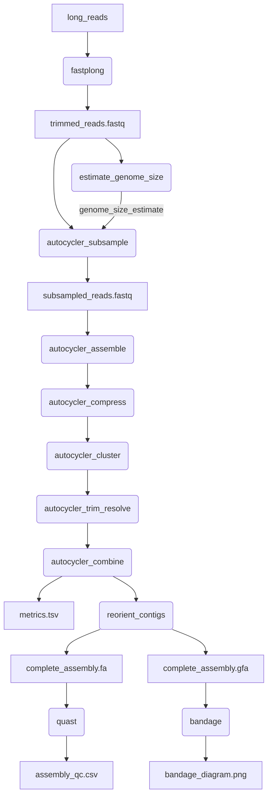

# autocycler-nf

A pipeline for running [rrwick/Autocycler](https://github.com/rrwick/Autocycler). Based on Ryan Wick's [autocycler_full.sh](https://github.com/rrwick/Autocycler/tree/main/pipelines/Automated_Autocycler_Bash_script_by_Ryan_Wick) script.

## Development Status

In active development. Not ready for use.

## Analyses



## Usage

### Basic usage

```
nextflow run BCCDC-PHL/autocycler-nf \
  -profile conda \
  --cache ~/.conda/envs \
  --fastq_input_long /path/to/your/fastqs \
  --outdir /path/to/your/outputs
```

By default, the pipeline will divide the input fastqs into 4 subsamples and assemble each subsample using the following assemblers:

```
canu
flye
metamdbg
miniasm
necat
nextdenovo
plassembler
raven
```

...resulting in 4 x 8 = 32 assemblies for each sample, which are combined into a final 'consensus assembly'.

### Custom Assemblers List

A customized assemblers list can be supplied using the `--assemblers_list` flag. For example, a file named `assemblers.txt` containing:

```
flye
raven
miniasm
plassembler
```

...can be supplied to the pipeline as follows:

```
nextflow run BCCDC-PHL/autocycler-nf \
  -profile conda \
  --cache ~/.conda/envs \
  --assemblers_list assemblers.txt \
  --fastq_input_long /path/to/your/fastqs \
  --outdir /path/to/your/outputs
```

### Read Types

By default, this pipeline assumes that the input reads are from an Oxford Nanopore sequencer,
using an R10-series flowcell (`ont_r10`).

Alternate read types can be indicated using the `--read_type` flag, for example:

```
nextflow run BCCDC-PHL/autocycler-nf \
  -profile conda \
  --cache ~/.conda/envs \
  --read_type ont_r9 \
  --fastq_input_long /path/to/your/fastqs \
  --outdir /path/to/your/outputs
```

Supported read types are:

```
ont_r9
ont_r10
pacbio_clr
pacbio_hifi
```

## Outputs

Below the directory supplied to the `--outdir` flag, one output directory will be created for each sample.
Within that directory, the following outputs will be created:


```
<sample_id>_<timestamp>_provenance.yml
<sample_id>_autocycler_genome_size_estimate.txt
<sample_id>_autocycler_input_assemblies
<sample_id>_autocycler_out
<sample_id>_autocycler_long.fa
<sample_id>_autocycler_long.gfa
<sample_id>_autocycler_long_bandage.png
<sample_id>_autocycler_long_quast.tsv
<sample_id>_autocycler_metrics.tsv
<sample_id>_autocycler_out
<sample_id>_fastplong.csv
<sample_id>_fastplong.html
<sample_id>_fastplong.json
<sample_id>_reorientation_summary.tsv
```
